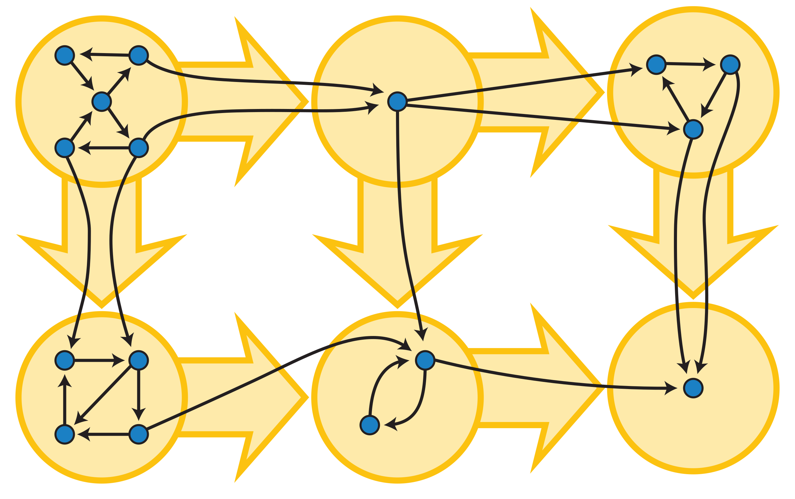

# Strong Connectivity
In a directed graph, the edges can be traversed in one direction only, so even if the graph is connected, this does not guarantee that there would be a path from
a node to another node. For this reason, it is meaningful to define a new concept that requires more than connectivity.

A graph is **strongly connected** if there is a path from any node to all other nodes in the graph. The **strongly connected components** of a graph divide the graph into strongly connected parts that are as large as possible. The strongly connected components form an acyclic component graph that represents the deep structure of the original graph.

The yellow directed acyclic graph is the condensation of the blue directed graph. It is formed by contracting each strongly connected component of the blue graph into a single yellow vertex

