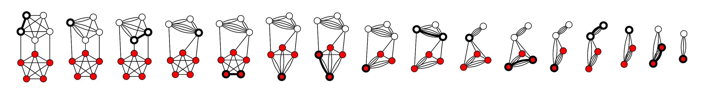

# Graph Contraction Algorithm
Graph contraction is a technique for computing properties of graph in parallel. As its name implies, it is a contraction technique, where we solve a problem by reducing to a smaller instance
of the same problem. Graph contraction is especially important because divide-and-conquer is difficult to apply to
graphs efficiently. The difficulty is that divide-and-conquer would require reliably partitioning
the graph into smaller graphs. Due to their irregular structure, graphs are difficult to partition.
In fact, graph partitioning problems are typically NP-hard.[^note]

## How to contract a graph
The algorithm performs the following steps
* **STEP 1**: Initialise temporary super node and super edge structures
* **STEP 2**: Contract the graph, until 2 super nodes are left
    * **STEP A**: select a random edge
    * **STEP B** : Contract the edge by merging the edge's nodes
    * **STEP C** : Collapse/Remove newly formed edge loops since src & dst is the new super node
    * **STEP D** : Identify all edges affected due to the collapsing of nodes
    * **STEP E** : Repoint affected edges to the new super node
* **STEP 3** : find the edges between the two super node sets

A visual example is the below image which shows the successful run of the contraction algorithm on a 10-vertex graph. The minimum cut has size 3.


## Implementation approach
The key to the implementation is to
* process all nodes and their edges, so you end up with two **super-sets** of nodes
* finally calculate the graph edges crossing the two node **super-sets**

### Helper Data Structures
Therefore, the following temporary data structures are necessary 
* **Super-nodes** : `HashMap` holding `[KEY:super-node, VALUE:set of merged nodes]`
* **Super-edges** : list of edges in the form of `HashBag` that holds hash pairs of `[VALUE:(source:super-node, destination:super-node)]`

Worth noting here that 
* We **must** be in a position to deal with repeating `(2..*)` `super-edges` resulting from the contraction of two `super-nodes`, hence the use `HashBag` which is an unordered multiset implementation. Use of `HashSet` results to elimination of `super-edge` multiples hence **_diminishing_** algorithm's statistical ability to produce the optimal graph contraction
* We **must** account for `SuperEdges` multiples while we (a) remove loops and (b) re-aligning `super-edges` following two `super-node` contraction

The following implementation of `Super-Edges` structure, provides and abstracts, the key operations of edge collapsing that is
* extract a random edge for the total set
* removal of an explicit edge
* repositioning of edges from one node onto another
```rust,no_run,noplayground
{{#include ../../src/graphs/min_cut.rs:graphs_min_cut_super_edges}}
```
Similarly, the `SuperNodes` structure, provides and abstracts
* the merging of two nodes into a super node
* indexed access to super nodes
* iterator
```rust,no_run,noplayground
{{#include ../../src/graphs/min_cut.rs:graphs_min_cut_super_nodes}}
```

The `SuperEdges` and `SuperNodes` structures are initiated from the `Graph` structure
```rust,no_run,noplayground
{{#include ../../src/graphs/min_cut.rs:graphs_min_cut_super_edges_graph}}
```
### Putting all together
With the supporting data structures in place we are able to write the following implementation for the contraction algorithm
```rust,no_run,noplayground
{{#include ../../src/graphs/min_cut.rs:graphs_contraction}}
```

## Finding Graph Edges between two sets of Nodes
Given subsets of nodes, in order to find the crossing edges we have to
* For each `src:node` in the `node subset A`
  * Extract the graph's `edges` originating from the `src:node`
  * Test for the `intersection` of graph's `edges` (aka destination nodes) against the `node subset B`
  * if the `intersection` is empty proceed, otherwise store the edges in a new `graph` 

Worth noting here that for every edge found we need to account for its opposite self, for example, for `Edge(2,3)` we need to also add `Edge(3,2)`

The below function returns the edges of a graph crossing two node subsets.
```rust,no_run,noplayground
{{#include ../../src/graphs/min_cut.rs:graphs_crossing}}
```

### References:
[^note]:[Graph Contraction and Connectivity](https://www.cs.cmu.edu/afs/cs/academic/class/15210-s15/www/lectures/graph-contract.pdf)