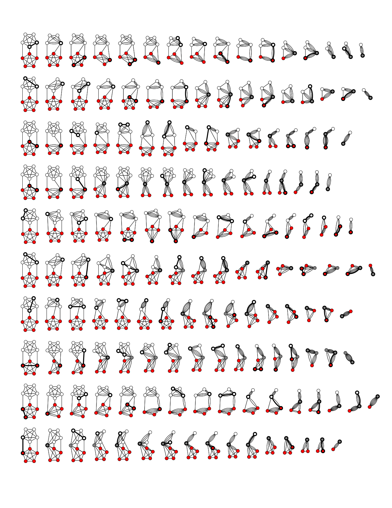

# Karger's Minimum Cut Algorithm
Karger's algorithm is a randomized algorithm to compute a minimum cut of a connected graph. The algorithm will ***randomly contract*** the graph a number of times in order to identify the minimum number of edges that when removed will cause the graph to split into two disjoint subsets that is minimal in some metric.

The key concept behind this algorithm is that the minimum cut relates to a **very small** subset of edges, hence statistically through random sampling and following a **number of trials** will always arrive to the graph's optimum cut; the probability to contract such edges is statistically small.

## How to find the minimum cut of a graph
The algorithm performs the following steps 
* Perform `N * log(N)` contractions of the graph, where `N` is the total number of graph nodes
  * Record the resulting minimum-cut per contraction
  * Compare result to current min-cut and if smaller make new min-cut the current
* Return the smallest minimum-cut recorded

The below image shows 10 repetitions of the contraction procedure. The 5th repetition finds the minimum cut of size 3


## Implementation approach
Given that we have a way to contract a graph down to two node subsets, all we have to do is to perform `N*log(N)` trials in order to find the minimum cut. 
```rust,no_run,noplayground
{{#include ../../src/graphs/min_cut.rs:graphs_min_cut}}
```
