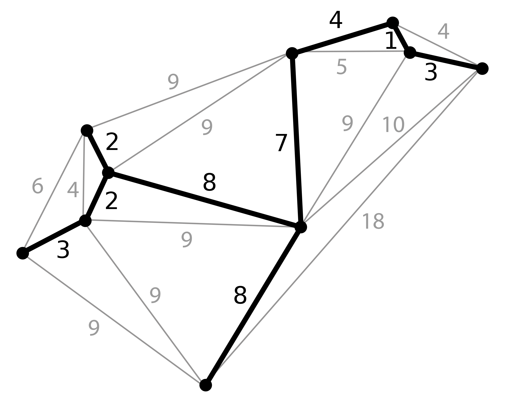

# Minimum Spanning Tree
A minimum spanning tree (MST) or minimum weight spanning tree is a subset of the edges of a connected, edge-weighted undirected graph that connects all the vertices together, without any cycles and with the minimum possible total edge weight.[^note]

That is, it is a spanning tree whose sum of edge weights is as small as possible.

More generally, any edge-weighted undirected graph (not necessarily connected) has a minimum spanning forest, which is a union of the minimum spanning trees for its connected components.

There are many use cases for minimum spanning trees. One example is a telecommunications company trying to lay cable in a new neighborhood. If it is constrained to bury the cable only along certain paths (e.g. roads), then there would be a graph containing the points (e.g. houses) connected by those paths. Some paths might be more expensive, because they are longer, or require the cable to be buried deeper; these paths would be represented by edges with larger weights

[^note]:[Wikipedia - Minimum spanning tree](https://en.wikipedia.org/wiki/Minimum_spanning_tree#Algorithms)

