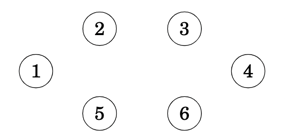
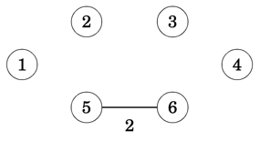
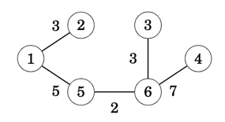

# Kruskal's MST Algorithm
In Kruskal’s algorithm, we start with the spanning tree containing **only** the nodes of the graph and with no any edges connecting the nodes. 

Then the algorithm goes through, adding the edges one at a time, ordered by their weights, and as long as the edge is not creating a cycle.

## Approach
The algorithm maintains the components of the tree. Initially, each node of the graph belongs to a separate component. As shown below there are six components since none of the nodes are connected.



Always when an edge is added to the tree, two components are joined as in the below example where nodes `5` and `6` form a new component



Finally, all nodes belong to the same component, and a minimum spanning tree has been found



Overall the approach can be summarised as following
1. **Phase 1**: Sort Edges by minimum cost first
2. **Phase 2**: Build Minimum Spanning Tree
   1. While there are more than `one` components
      1. Retrieve edge with the lowest weight `(src,dst)`
      2. Find component for `src`, let's say it is `src'`
      3. Find component for `dst`, let's say it is `dst'`
      4. if `src'` is different to `dst'` then
         1. Merge `src'` and `dst'`
         2. Add edge `(src,dst)` into the graph

### Super Nodes as Components
The `SuperNodes` struct used to solve the **minimum cut** algorithm is more or less the right tool in this instance given that the definition of a `super node` is synonymous to a graph component.

The `SuperNodes` structure, provides us with the
* merging of two super node components into a super node
  * finding of the super node component that a given node belongs to
```rust,no_run,noplayground
{{#include ../../src/graphs/min_cut.rs:graphs_min_cut_super_nodes}}
```
### BinaryHeap for edge Ordering
To provide an ordered edge list we use the `BinaryHeap` collection that uses the edge's `weight` as the prioritisation key. The following `Step` implementation provide us with the desirable result.
```rust,no_run,noplayground
{{#include ../../src/greedy/mod.rs:graphs_mst_step}}
```
Additionally, we have the following helper `Graph` functions that provide us with 
* the ordered edge list
* the sum of weights for all edges in the graph
* adding an edge into the graph
```rust,no_run,noplayground
{{#include ../../src/greedy/mod.rs:graphs_mst_graph}}
```

## Implementation
As a result, the following implementation consolidates all of the above into the Kruskal's algorithm implementation.
```rust,no_run,noplayground
{{#include ../../src/greedy/mod.rs:graphs_mst}}
```
