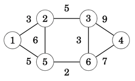
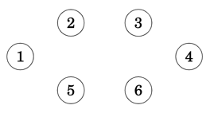
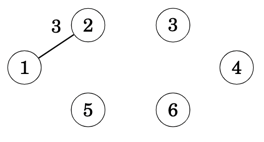
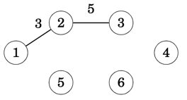
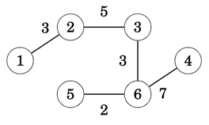

# Prim's MST Algorithm
Prim’s algorithm resembles Dijkstra’s algorithm. The difference is that Dijkstra’s algorithm always selects an edge whose distance from the starting node is minimum, but Prim’s algorithm simply selects the minimum weight edge that adds a new node to the tree

## Approach
The algorithm first adds an arbitrary node to the tree. After this, the algorithm always chooses a minimum-weight edge that adds a new node to the tree. Finally, all nodes have been added to the tree and a minimum spanning tree has been found

To illustrate how the algorithm works let's consider the following `input` graph



When we start, the minimum spanning tree has no edges



We then select an arbitrary node, in this case `1`, and from edges `(1,2),(1,5)` we choose the edge `(1,2)` that has the lowest weight, and we then add it into the output tree. At this point in time, nodes `[1,2]` are spawned into the evolving tree.



With edge `(1,2)` added to the tree, we're looking to all edges that cross between the tree and the non-tree nodes. In this case we have edges `[(1,5),(2,5),(2,3)]` with `(2,3)` being the one that has the lowest weight from all known crossing edges.

At this point the tree contains nodes `[1,2,3]` with nodes remaining outside the tree as `[5,6,4]`



We repeat the process, always expanding one node at a time and adding to the tree the lowest weight edge each time and until there are no more nodes remaining outside the tree.



## Min-Ordered edge BinaryHeap
To provide a minimum-ordered edge list, we make use of the BinaryHeap collection with the edge's weight as the prioritisation key. The following Step implementation provide us with the desirable result

```rust,no_run,noplayground
{{#include ../../src/greedy/mod.rs:graphs_mst_step}}
```

## Implementation
Few key points related to the below implementation
1. We hold the evolving tree in a `Graph` structure with its `nodes` `HashSet` representing the tree's Component for queries
2. When we spawn a new node, we don't search for the minimum weight edge, rather we store all crossing edges in the `heap`;
3. Edges added in the `heap` might go **stale**, that is, future iterations cause edges nodes to be pulled inside the `tree` component, hence when extracting the min-weight edge from the `heap` we need to ensure the edge isn't stale.  

As a result, the following implementation consolidates all of the above into the Prim's algorithm implementation.
```rust,no_run,noplayground
{{#include ../../src/greedy/mst.rs:graphs_mst_graph_prim}}
```