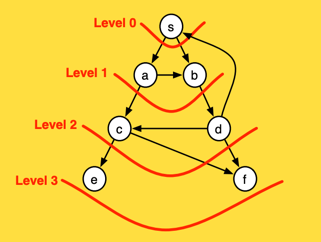

# Shortest Distance Path
In this case, we want to determine if one vertex is reachable from another. Recall that a vertex `u` is reachable from `v` if there is a (directed) path from `v` to `u`.[^note]

## Search Strategy: Breadth First Search (BFS) Algorithm
The breadth-first algorithm is a particular graph-search algorithm that can be applied to solve a variety of problems such as 
* finding all the vertices reachable from a given vertex, 
* finding if an undirected graph is connected, 
* finding (in an unweighted graph) the shortest path from a given vertex to all other vertices, 
* determining if a graph is bipartite, 
* bounding the diameter of an undirected graph, 
* partitioning graphs, 
* and as a subroutine for finding the maximum flow in a  flow network (using Ford-Fulkerson’s algorithm).

As with the other graph searches, BFS can be applied to both directed and undirected graphs.

## BFS Approach
The idea of breadth first search is to start at a source vertex `s` and explore the graph outward
in all directions level by level, first visiting all vertices that are the (out-)neighbors of `s` (i.e. have
distance 1 from s), then vertices that have distance two from `s`, then distance three, etc. More
precisely, suppose that we are given a graph `G` and a source `s`. We define the level of a vertex `v`
as the shortest distance from `s` to `v`, that is the number of edges on the shortest path connecting `s`
to `v`.


The above animated image provides an insight into the processing steps
* Starting node `a` is pushed to the queue with `level` set to `0`
* Pop the `(node,level)` from the queue; at first this is `(a,0)`
  * Mark node as `visited` (black)
  * For each edge coming off the node
    * If edge is not visited 
      * calculate `edge-level` as one edge away from `node`, that is, `level + 1` 
      * push `(edge, edge-level)` at the end of the queue for `processing` (gray)

As a result and as depicted below, at the end of the graph processing, all nodes have been allocated into depth levels 



## Implementation
The following implementation realises the BFS algorithm 
```rust,no_run,noplayground
{{#include ../../src/graphs/path_search.rs:graphs_search_path_shortest}}
```

### References:
[^note]:[Graph Searches](https://www.cs.cmu.edu/afs/cs/academic/class/15210-s15/www/lectures/graph-searches.pdf)
